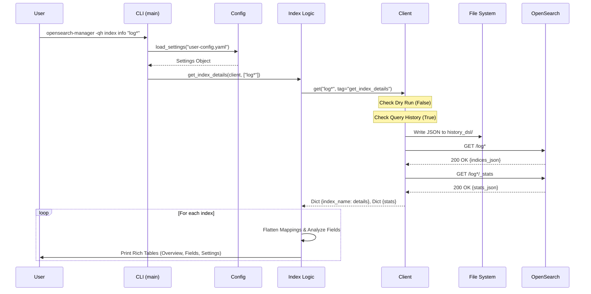

# Architecture Documentation

This document outlines the high-level architecture, component interactions, and data flow of the `OpenSearch_Management` tool.

## 1. Project Structure

The project follows a standard Python package structure with a separation of concerns between the CLI interface, configuration, client infrastructure, and business logic.

```text
OpenSearch_Management/
├── docs/                       # Documentation (Dev flow, Usage, Architecture)
├── history_dsl/                # Generated Query History (JSON files)
├── src/
│   └── opensearch_management/
│       ├── __init__.py
│       ├── cli.py              # [Entry Point] Typer CLI application & command routing
│       ├── client.py           # [Infrastructure] HTTP Client wrapper (Requests, Dry-Run, History)
│       ├── config.py           # [Configuration] Pydantic models & YAML loader
│       ├── logging.py          # [Observability] Structlog configuration
│       └── logic/              # [Business Logic] Domain-specific operations
│           └── index_operations.py  # Index retrieval & parsing logic
├── tests/                      # Unit & Integration Tests
│   ├── test_cli.py
│   ├── test_client.py
│   └── test_config.py
├── user-config.yaml            # User Configuration (Auth, Connection, Settings)
├── pyproject.toml              # Project Metadata & Dependencies
└── README.md
```

---

## 2. High-Level Architecture

The tool is designed as a layered application:

1.  **Interface Layer (CLI)**: Handles user input, argument parsing, and command dispatch using `typer`.
2.  **Configuration Layer**: Loads settings from `user-config.yaml` into typed Pydantic models.
3.  **Logic Layer**: Contains the specific business rules for OpenSearch resources (Indices, Pipelines, Models).
4.  **Infrastructure Layer (Client)**: Wraps the HTTP communication, handling authentication, dry-runs, and query logging.

```mermaid
graph TD
    User[User] -->|Command| CLI[CLI (cli.py)]
    CLI -->|Load| Config[Config (config.py)]
    Config -->|Read| YAML[user-config.yaml]
    
    CLI -->|Dispatch| Logic[Logic Layer (logic/*)]
    Logic -->|Use| Client[OpenSearchClient (client.py)]
    
    Client -->|Check| DryRun{Dry Run?}
    DryRun -- Yes --> Console[Print to Console]
    DryRun -- No --> History{Save History?}
    
    History -- Yes --> Disk[Save JSON to history_dsl/]
    History -- No --> Request[Execute HTTP Request]
    Disk --> Request
    
    Request -->|HTTP| OpenSearch[OpenSearch Cluster]
    OpenSearch -->|JSON Response| Client
    Client -->|Data| Logic
    Logic -->|Formatted Output| User
```

---

## 3. Component Descriptions

### A. CLI (`cli.py`)
*   **Role**: The entry point of the application.
*   **Responsibilities**:
    *   Defines commands and subcommands (e.g., `index info`).
    *   Parses global flags (`--dry-run`, `--query-history`, `--config`).
    *   Initializes the `OpenSearchClient` with the loaded configuration.
    *   Passes control to the appropriate logic function.

### B. Configuration (`config.py`)
*   **Role**: Centralized configuration management.
*   **Responsibilities**:
    *   Defines the schema for configuration using Pydantic models (`ConnectionConfig`, `AuthConfig`, etc.).
    *   Loads and validates `user-config.yaml`.
    *   Provides default values for missing settings.

### C. Client (`client.py`)
*   **Role**: The communication backbone.
*   **Responsibilities**:
    *   **Wrapper**: Wraps the `requests` library to provide `get`, `post`, `put`, `delete` methods.
    *   **Dry Run**: Intercepts requests to print them instead of executing them when enabled.
    *   **Query History**: Serializes request details (Method, URL, Body) to JSON files for audit/replay.
    *   **Error Handling**: Manages connection errors and HTTP status codes.

### D. Logic (`logic/`)
*   **Role**: Domain-specific implementation details.
*   **Responsibilities**:
    *   **`index_operations.py`**: Handles `index info` command.
        *   Fetches index details (`GET /<index>`) and stats (`GET /<index>/_stats`).
        *   Recursively parses mappings to flatten nested fields and multi-fields.
        *   Analyzes field types to provide query recommendations (e.g., `keyword` -> `term`).
        *   Formats the output using `rich` Tables and Panels for readability.

---

## 4. Request Flow Chart

This diagram illustrates the lifecycle of a single command execution, specifically for `opensearch-manager index info`.


